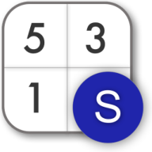
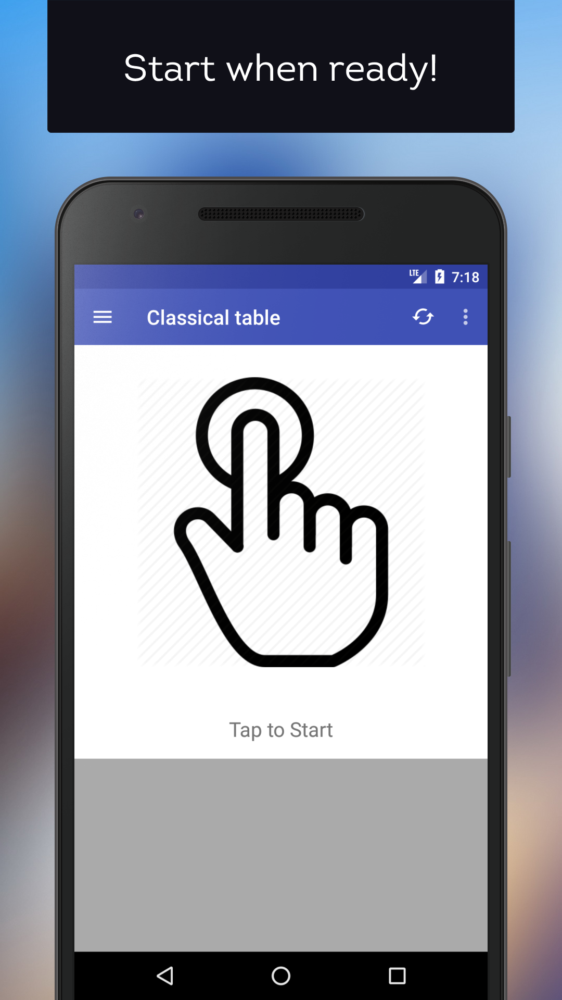
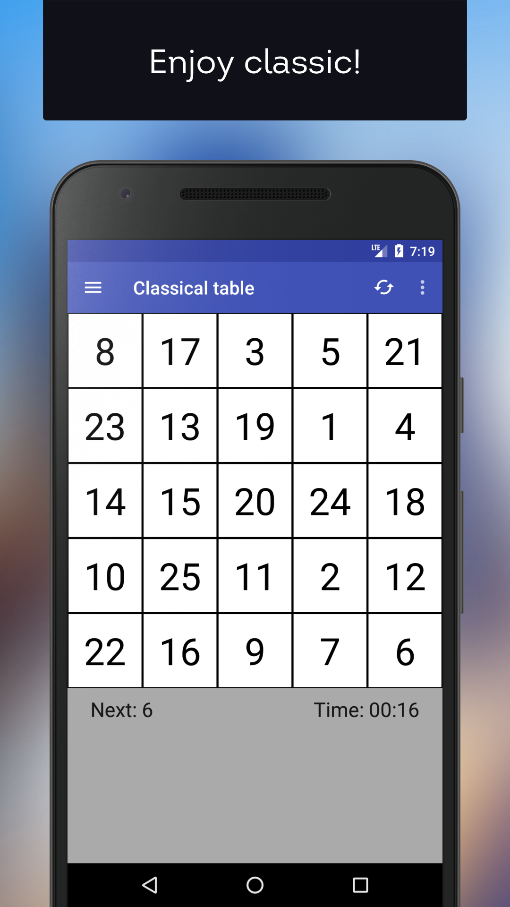
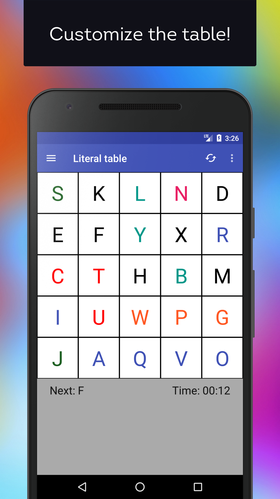
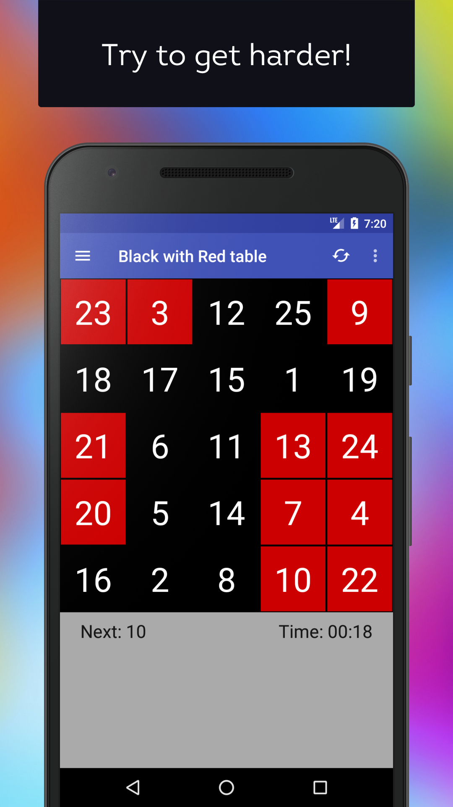
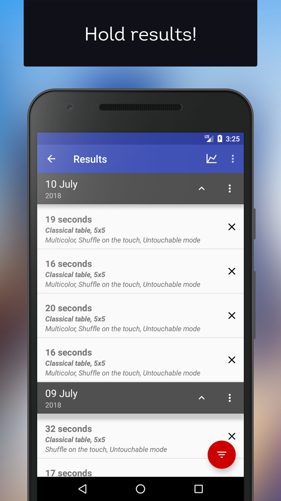
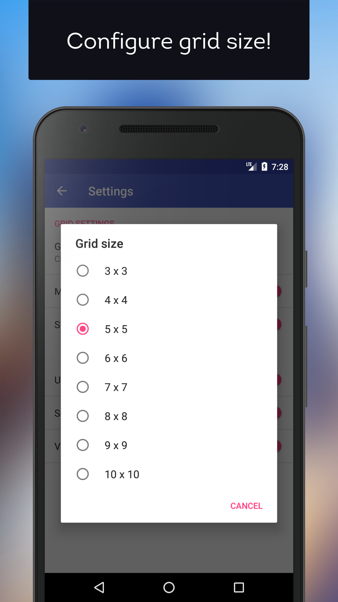
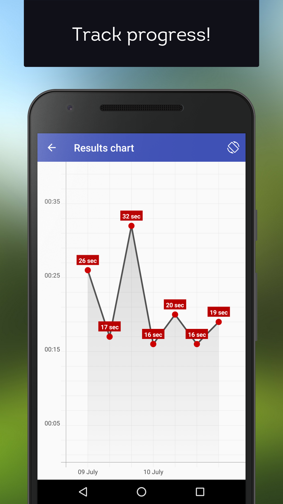
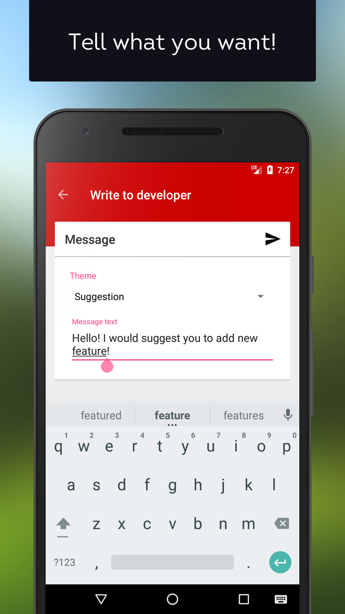

<h1 align="center">
   
   
  
   
   
</h1>

# Schulte Table
Schulte Table - an application that helps you increase peripheral vision, general perception and speed of reading. The app contains a table with 25 items with different numbers from 1 to 25. User needs to find all numbers in that table starting from finding number "1" and ending on "25". 

**Latest production version: 1.2.0**

## Download

- [Schulte Table - Google Play](https://play.google.com/store/apps/details?id=com.samusko.bohdan.schultetable)

## Screenshots

<h1 align="center">
 
 

 
 
</h1>
<h1 align="center">
 
 

 
 
</h1>
<h1 align="center">
 
 

 
 
</h1>
<h1 align="center">
 
 

 
 
</h1>
<h1 align="center">
 
 

 
 
</h1>
<h1 align="center">
 
 

 
 
</h1>
<h1 align="center">
 
 

 
 
</h1>
<h1 align="center">
 
 

 
 
</h1>

## Bug report

If you found a bug, please open the application, click on burger menu at to left corner and press "Write to developer" to send report over email.
